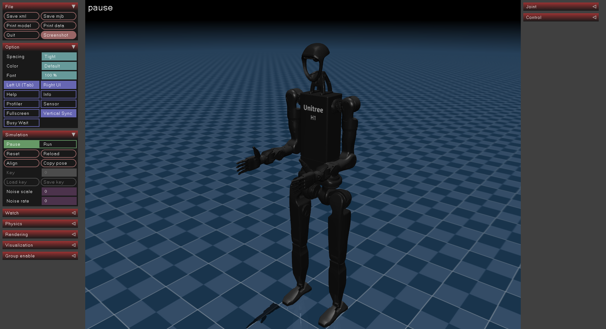

# Unitree H1_2 Description (URDF & MJCF)

## Overview

This package includes a universal humanoid robot description (URDF & MJCF) for the [Unitree H1_2](https://www.unitree.com/h1), developed by [Unitree Robotics](https://www.unitree.com/).

<p align="center">
  
</p>

## Visulization with [MuJoCo](https://github.com/google-deepmind/mujoco)

1. Open MuJoCo Viewer

   ```bash
   pip install mujoco
   python -m mujoco.viewer
   ```

2. Drag and drop the MJCF model file (`h1_2.xml` or `h1_2_handless.xml`) to the MuJoCo Viewer.
