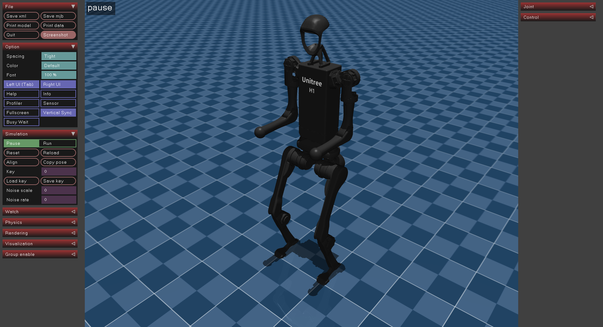

# Unitree H1 Description (URDF & MJCF)

## Overview

This package includes a universal humanoid robot description (URDF & MJCF) for the [Unitree H1](https://www.unitree.com/h1), developed by [Unitree Robotics](https://www.unitree.com/).

The file `urdf/h1.urdf` is description for H1 without hands, and `urdf/h1_with_hand.urdf` for H1 with dexterous hands. Both `urdf/h1.urdf` and `urdf/h1_with_hand.urdf` support isaacgym environment.

<p align="center">
  
</p>

Basic H1 Humanoid have 19 joints:

```text
root [⚓] => /pelvis/
    left_hip_yaw_joint [⚙+Z] => /left_hip_yaw_link/
        left_hip_roll_joint [⚙+X] => /left_hip_roll_link/
            left_hip_pitch_joint [⚙+Y] => /left_hip_pitch_link/
                left_knee_joint [⚙+Y] => /left_knee_link/
                    left_ankle_joint [⚙+Y] => /left_ankle_link/
    right_hip_yaw_joint [⚙+Z] => /right_hip_yaw_link/
        right_hip_roll_joint [⚙+X] => /right_hip_roll_link/
            right_hip_pitch_joint [⚙+Y] => /right_hip_pitch_link/
                right_knee_joint [⚙+Y] => /right_knee_link/
                    right_ankle_joint [⚙+Y] => /right_ankle_link/
    torso_joint [⚙+Z] => /torso_link/
        left_shoulder_pitch_joint [⚙+Y] => /left_shoulder_pitch_link/
            left_shoulder_roll_joint [⚙+X] => /left_shoulder_roll_link/
                left_shoulder_yaw_joint [⚙+Z] => /left_shoulder_yaw_link/
                    left_elbow_joint [⚙+Y] => /left_elbow_link/
        right_shoulder_pitch_joint [⚙+Y] => /right_shoulder_pitch_link/
            right_shoulder_roll_joint [⚙+X] => /right_shoulder_roll_link/
                right_shoulder_yaw_joint [⚙+Z] => /right_shoulder_yaw_link/
                    right_elbow_joint [⚙+Y] => /right_elbow_link/
```

## Usages

### [MuJoCo](https://github.com/google-deepmind/mujoco)(recommend)

```bash
pip install mujoco
python -m mujoco.viewer --mjcf=mjcf/scene.xml
```

### RViz

```bash
roslaunch h1_description display.launch
```

### Gazebo

```bash
roslaunch h1_description gazebo.launch
```
